# The PS4 video decoder: technical reference

What this project learned about decoding video on the PS4 from a homebrew app, for
low-latency streaming: the libSceVideodec2 API in detail, how the system decoder is built
inside, what it can and cannot do, the measurements, and what comes after the decoder
(colour conversion and paced display). It complements the
[PS VR technical reference](psvr-technical-reference.md), which covers the headset side.

How the facts were established: the system libraries' own parameter checks and internal
structure, read from the libraries the console loads; the
[shadPS4](https://github.com/shadps4-emu/shadPS4) emulator's headers for the public
structures; and a video bench that plays real game footage through the real decoder on the
console (PS4 FAT and PS4 Pro, firmware 11.00 with GoldHEN). Statements are marked
**verified** (seen working or measured on hardware), **observed** (seen in logs, not fully
understood) or **inferred** (deduced from the libraries, not exercised).

Code: `client/src/video.cpp` (decoder, conversion, paced display), `client/src/bench.cpp`
and `tools/video_bench.py` (the bench).

Contents:

1. [Summary](#1-summary)
2. [Inside the system decoder](#2-inside-the-system-decoder)
3. [libSceVideodec2: the API](#3-libscevideodec2-the-api)
4. [Pipeline depth: latency against throughput](#4-pipeline-depth-latency-against-throughput)
5. [Measurements](#5-measurements)
6. [Resource types and the hardware decoder question](#6-resource-types-and-the-hardware-decoder-question)
7. [libSceVideodec (v1)](#7-libscevideodec-v1)
8. [Feeding the decoder from a network stream](#8-feeding-the-decoder-from-a-network-stream)
9. [After the decoder: NV12 to RGB](#9-after-the-decoder-nv12-to-rgb)
10. [After the decoder: paced display](#10-after-the-decoder-paced-display)
11. [Error codes](#11-error-codes)
12. [Open questions](#12-open-questions)

---

## 1. Summary

- Apps get one practical decoder: **libSceVideodec2 with resource type 1**. It decodes
  H.264 (High, Main, Baseline) and HEVC (Main) in **software**: CPU threads plus GPU compute
  shaders. The PS4's hardware video decoder is not reachable through it (**verified** by
  elimination, [section 6](#6-resource-types-and-the-hardware-decoder-question)).
- A picture takes about **20-25 ms** from its submission to being ready at 1920×1056, but the
  decoder works on several pictures at once: with a pipeline depth of 3 it sustains
  **90 frames per second** with room to spare (110-150 frames per second at 60-80 Mbps).
- H.264 is faster than HEVC on it. CAVLC entropy coding decodes much faster than CABAC.
- Keep the decoded frame within about **1920×1088**: above it, the cost rises sharply.
- Output is linear NV12; converting it to RGB on the CPU with SSE takes about 4 ms per
  1920×1056 frame over four threads.

### The whole pipeline

How one frame travels in this project, from the head motion the camera sees to the photons
on the PSVR panel, with the times measured at 90 Hz in Beat Saber (about 60 ms from head
motion to photons in all). Solid arrows carry the poses and the video; dotted arrows show
the compositor's own head tracking and the request for a new IDR frame when one is lost.

```mermaid
flowchart LR
    subgraph TRK["PS4 tracking"]
        tracker["VR tracker<br/>PS Camera 60 Hz + IMUs"]
    end

    subgraph PC["PC: SteamVR + ALVR streamer 20.14.1"]
        game["Game renders both eyes<br/>with the head pose received"]
        fov["Foveated encoding<br/>2496×1408 → 1920×1056"]
        enc["NVENC H.264<br/>CAVLC, CBR 80 Mbps<br/>no B-frames"]
        game --> fov --> enc
    end

    subgraph PS4["PS4 client"]
        net["Network thread<br/>reassembles frames"]
        queue["Decode queue<br/>12 slots"]
        dec["libSceVideodec2<br/>software: CPU + GPU<br/>depth 3 at 90 fps<br/>~20-25 ms"]
        conv["NV12 → BGRA<br/>4 threads, foveated<br/>edges expanded, ~4 ms"]
        ready["Ready frames<br/>due time = PC clock<br/>+ jitter margin"]
        pick["Before each<br/>compositor pass:<br/>newest due frame,<br/>1.5 ms hysteresis"]
        net --> queue --> dec --> conv --> ready --> pick
    end

    subgraph SYS["PS4 system"]
        comp["Compositor<br/>libSceHmd reprojection<br/>warp + lens distortion"]
        panel["PSVR panel<br/>1920×1080<br/>90 / 120 Hz"]
        comp -->|"~4 ms"| panel
    end

    tracker -->|"head + controller poses<br/>head position predicted"| game
    enc ==>|"UDP, port 9944"| net
    pick ==>|"frame + its render pose"| comp
    tracker -.->|"latest head rotation"| comp
    dec -.->|"frame lost: request IDR"| enc
```



## 2. Inside the system decoder

libSceVideodec2 is a thin front end. The work is done by a core library, libSceVdecCore,
which in turn loads codec libraries on demand (**inferred** from the libraries):

| Library | Role | Loaded as internal sysmodule |
| --- | --- | --- |
| libSceVdecCore | Decoder core: queues, memory, picture management, GPU submission | (dependency of libSceVideodec2) |
| libSceVdecSavc | Software H.264 decoder | `0x80000035` |
| libSceVdecSavc2 | Software H.264 decoder, second generation (CPU + GPU compute) | `0x80000036` |
| libSceVdecShevc | Software HEVC decoder | `0x8000003c` |

The core's only other dependencies are the GPU driver (libSceGnmDriver), the kernel, the
sysmodule manager and the system service (for `sceSystemServiceActivateHevc` /
`ActivateHevcSoft`, which it calls when it creates an HEVC decoder). It has no other way to
reach a hardware decoder: everything it does goes through those software codecs and GPU
command buffers.

The core runs in one of several **modes**. libSceVideodec2 picks the mode from the
configuration's `resource_type` (**inferred**, from the front end's code):

| resource_type | Core mode | Notes |
| --- | --- | --- |
| 1 | 2 | Needs a compute queue. The normal path. |
| `0xb6c8` | 4 | No compute queue. |
| `0x12384` | 8 | No compute queue. Only when `sceKernelIsNeoMode()` returns 1 (a PS4 Pro running the app in Pro mode); otherwise `0x811d0203`. |
| anything else | | `0x811d0203` |

The core itself refuses modes 6, 7 and 8 unless the main SoC id
(`sceKernelGetMainSocId() & 0xffffff80`) is `0x740f00`, the PS4 Pro's chip; on that chip
some other modes get extra variants. With modes 4 and 8, libSceVideodec2 caps the pipeline
depth at 5.

## 3. libSceVideodec2: the API

Sysmodule id `0x00CF`. Every structure starts with its own size, which the library checks.

### Configuration

```c
struct Vdec2ConfigInfo {                 // 0x48 bytes
    uint64_t this_size;                  // 0x00  0x48
    uint32_t resource_type;              // 0x08  1 (section 6)
    uint32_t codec_type;                 // 0x0c  1 = H.264, 0xee049 = HEVC
    uint32_t profile;                    // 0x10  H.264: 66 Baseline, 77 Main, 100 High; HEVC: 1 Main, 2 Main 10
    uint32_t max_level;                  // 0x14  level_idc (below)
    int32_t  max_frame_width;            // 0x18  multiple of 16
    int32_t  max_frame_height;           // 0x1c
    int32_t  max_dpb_frame_count;        // 0x20  -1 (the library chooses) .. 16
    uint32_t decode_pipeline_depth;      // 0x24  1..8 (section 4)
    void    *compute_queue;              // 0x28  required for resource_type 1
    uint64_t cpu_affinity_mask;          // 0x30  bits 0..5 (the six cores apps get)
    int32_t  cpu_thread_priority;        // 0x38  -1 (default) or 256..767; 256 is the highest
    uint8_t  optimize_progressive;       // 0x3c
    uint8_t  check_memory_type;          // 0x3d  1: the library checks that each memory has the right type
    uint8_t  reserved0, reserved1;       // 0x3e  must be 0
    void    *extra_config_info;          // 0x40  NULL for H.264; optional HEVC extension
};
```

Accepted levels (`level_idc`, **inferred** from the checks):

- H.264: 10-13, 20-22, 30-32, 40-42, 50-52, 60-62 (that is level 1 to 6.2).
- HEVC: 30, 60, 63, 90, 93, 120, 123, 150, 153, 156 (level 1 to 5.2, `level_idc` = 30 ×
  level). HEVC also accepts an `extra_config_info` block of 0x18 or 0x20 bytes (frame format
  `0xc24a`, and other options not studied).

Declare the stream's real level or higher: the decoder sizes its picture buffers from it.

Settings used and **verified** for a 1920×1056 low-latency stream: H.264 profile 100, level
52, max DPB 16, depth 3, affinity `0x3f`, priority 256, `optimize_progressive` 1,
`check_memory_type` 0.

### Compute queue (resource type 1)

```c
struct Vdec2ComputeMemoryInfo { uint64_t this_size /*0x18*/; uint64_t cpu_gpu_memory_size; void *cpu_gpu_memory; };
struct Vdec2ComputeConfigInfo {          // 0x10 bytes
    uint64_t this_size;                  // 0x10
    uint16_t compute_pipe_id;            // 0..4
    uint16_t compute_queue_id;           // 0..7
    uint8_t  check_memory_type;
    uint8_t  reserved0;
    uint16_t reserved1;
};
int sceVideodec2QueryComputeMemoryInfo(Vdec2ComputeMemoryInfo *m);       // 0x495200 bytes (observed)
int sceVideodec2AllocateComputeQueue(const Vdec2ComputeConfigInfo *c, const Vdec2ComputeMemoryInfo *m, void **queue);
int sceVideodec2ReleaseComputeQueue(void *queue);
```

The queue memory is CPU-GPU memory (onion, type 0, 64 KB alignment works). Pipe 2, queue 0
worked (**verified**). A pipe and queue another library already uses fails: the VR tracker
takes pipe 4, queue 4, so a VR app must pick another one; this project tries (2,0), (3,0),
(1,0), (2,3), (3,5), (0,6) in turn. One queue serves any number of decoders; keep it for
the app's lifetime.

### Memory

```c
struct Vdec2MemoryInfo {                 // 0x48 bytes
    uint64_t this_size;                  // 0x48
    uint64_t cpu_memory_size;      void *cpu_memory;       // onion (type 0), 64 KB alignment
    uint64_t gpu_memory_size;      void *gpu_memory;       // garlic (type 3), 2 MB alignment
    uint64_t cpu_gpu_memory_size;  void *cpu_gpu_memory;   // onion (type 0), 64 KB alignment
    uint64_t max_frame_buffer_size;                        // size of one output frame buffer
    uint32_t frame_buffer_alignment;                       // 256
    uint32_t reserved0;                                    // 0
};
int sceVideodec2QueryDecoderMemoryInfo(const Vdec2ConfigInfo *c, Vdec2MemoryInfo *m);
int sceVideodec2CreateDecoder(const Vdec2ConfigInfo *c, const Vdec2MemoryInfo *m, void **decoder);
int sceVideodec2DeleteDecoder(void *decoder);
```

`QueryDecoderMemoryInfo` fills the sizes; the app allocates direct memory of each type,
fills the pointers and creates the decoder. Sizes for H.264 1920×1056, level 52, DPB 16
(**observed**):

| Depth | CPU | GPU | CPU-GPU | Frame buffer |
| --- | --- | --- | --- | --- |
| 1 | 43.4 MB | 99.8 MB | 11.3 MB | 3.1 MB |
| 2 | 44.6 MB | 99.8 MB | 20.2 MB | 3.1 MB |
| 3 | 45.8 MB | 99.8 MB | 28.0 MB | 3.1 MB |
| 4 | 47.1 MB | 99.8 MB | 35.8 MB | 3.1 MB |

About 175 MB in all at depth 3, so allocate once for the largest stream expected and reuse
the memory when a smaller stream starts (the sizes only shrink).

### Decoding

```c
struct Vdec2InputData {                  // 0x30 bytes
    uint64_t this_size;                  // 0x30
    const void *au_data;                 // one access unit, Annex B (start codes)
    uint64_t au_size;
    uint64_t pts, dts;                   // passed through to the output's picture
    uint64_t attached;                   // any value; passed through
};
struct Vdec2FrameBuffer {                // 0x20 bytes
    uint64_t this_size;                  // 0x20
    void    *frame_buffer;               // 256-byte aligned, max_frame_buffer_size bytes
    uint64_t frame_buffer_size;
    uint8_t  is_accepted;                // set by the library
    uint8_t  pad[7];
};
struct Vdec2OutputInfo {                 // 0x38 bytes
    uint64_t this_size;                  // 0x38
    uint8_t  is_valid;                   // a picture came out
    uint8_t  is_error_frame;             // decoded with errors (concealed)
    uint8_t  picture_count;
    uint8_t  unk0b;
    uint32_t codec_type;
    uint32_t frame_width, frame_pitch, frame_height;
    uint32_t pad1c;
    void    *frame_buffer;               // the frame buffer holding the picture
    uint64_t frame_buffer_size;
    uint32_t frame_format;               // 0, or 0xc24a
    uint32_t frame_pitch_in_bytes;       // may be 0
};
int sceVideodec2Decode(void *decoder, const Vdec2InputData *in, Vdec2FrameBuffer *fb, Vdec2OutputInfo *out);
int sceVideodec2Flush(void *decoder, Vdec2FrameBuffer *fb, Vdec2OutputInfo *out);
int sceVideodec2Reset(void *decoder);
```

Facts (**verified**):

- Each `Decode` takes one complete access unit (all slices of one picture) and a frame
  buffer to write a picture into. Which picture comes out depends on the pipeline depth
  ([section 4](#4-pipeline-depth-latency-against-throughput)); `is_valid` says whether one
  did.
- **Output format:** linear NV12, a full-resolution Y plane followed by the half-resolution
  interleaved UV plane, with `frame_pitch` = width (1920 for 1920×1056).
- The output picture may be in a frame buffer given to an earlier call: track the buffers by
  the `frame_buffer` pointer of the output, not by the call.
- `pts` and `attached` come back with the picture they belong to. Keeping your own FIFO of
  per-frame data (receive time, tracking pose) keyed by submission order also works, since
  pictures come out in order for a low-delay stream (no B-frames).
- `Reset` drops everything in flight; the next access unit must be an IDR frame.
- **Parameter sets:** the decoder needs the SPS and PPS (and VPS for HEVC) in front of each
  IDR frame it starts from. A streamer that sends them separately (ALVR does) requires the
  client to prepend them; reserve a little room in front of each access unit buffer for it.
- Creating a decoder is quick (a few milliseconds after the memory query) but allocates a
  lot of memory: do it per stream or per resolution change, never per frame.

## 4. Pipeline depth: latency against throughput

`decode_pipeline_depth` is the key setting. With depth N, a `Decode` call returns the picture
of the access unit given N - 1 calls earlier, and **blocks until that picture is ready**.

| Depth | Behaviour at 90 frames per second, 1920×1056 (**verified**) |
| --- | --- |
| 1 | Every call waits for its own picture, about 20-24 ms: 42-48 frames per second at most. |
| 2 | Each call waits about 11 ms for the previous picture, just over the 11.1 ms frame time: the input queue grows, frames are dropped, latency 45-60 ms. |
| 3 | Calls return in 1-2 ms: 90 frames per second with no drop up to 130 Mbps, 27-30 ms from receiving an access unit to its picture being ready. |
| 4 | Same throughput as 3, one frame time (11 ms) more latency. |

So the decoder's own latency is about 20-24 ms per picture while it completes one every
7-10 ms: it overlaps pictures. Depth must be high enough that a call never waits longer
than a frame time:

- at **90 frames per second**: depth 3;
- at **60 frames per second**: depth 2 is enough (each call waits about 3 ms), and depth 3
  would only add 16.7 ms of latency.

Smaller frames decode faster and make depth 2 possible at 90 frames per second: at
1536×832 the bench held 90 frames per second at depth 2 (25 ms instead of 30). In a real
game, though, the pictures then came out irregularly (40-80 repeated or skipped frames per
5 seconds instead of 12-35) and the decoder fell behind after a minute: depth 2 at 90 frames
per second was not usable (**verified**).

## 5. Measurements

All from the video bench: a Beat Saber recording, re-encoded on the PC with NVENC using
ALVR's low-latency settings (CBR, one-frame VBV, infinite GOP, no B-frames, CAVLC, preset P4
low latency), played on the console at 90 frames per second through the real decoder and
conversion. "Latency" is from the access unit's arrival to its converted picture.

### Bitrate (depth 3, 1920×1056)

| Bitrate | Latency (average / p99) | Frame rate | Drops |
| --- | --- | --- | --- |
| 40 Mbps | 27.4 / 31-35 ms | 89.8 | 0 |
| 60 Mbps | 27.2 / 29-39 ms | 89.8 | 0 |
| 80 Mbps | 27.1 / 29-44 ms | 89.8 | 0 |
| 100 Mbps | 27.1 / 35-50 ms | 89.8 | 0 |
| 130 Mbps | 27.3 / 43-63 ms | 89.8 | 0 |
| 160 Mbps | 29-55 ms | 87.9-89.8 | 0-13 |

Highest sustained frame rate (as fast as the decoder takes them, depth 3), worst clip /
others: 60 Mbps 116 / 119-148, 100 Mbps 103 / 106-133, 160 Mbps 88 / 92-112 frames per
second. The cost is roughly 7 ms per picture plus 0.02 ms per KB.

### Frame size (80 Mbps)

| Decoded frame | Depth 3: latency avg / p99 | Depth 2: latency avg / p99, frame rate |
| --- | --- | --- |
| 1920×1056 | 30.4 / 56.8 ms | 150 ms, 70 fps (falls behind) |
| 1856×1024 | 29.1 / 57.4 ms | 144 ms, 73 fps |
| 1792×992 | 28.4 / 53.6 ms | 134 ms, 78 fps |
| 1664×928 | 27.3 / 43.5 ms | 129 ms, 80 fps |
| 1536×832 | 27.1 / 35.8 ms | 24.7 / 50.5 ms, 90 fps |
| 1280×704 | 27.2 / 32.6 ms | 20.2 / 36.9 ms, 90 fps |

At depth 3 the average barely moves with the size (the pipeline sets it), but the peaks
shrink. Earlier tests with the live stream showed the cost climbing steeply above about
1920×1088 (8704 macroblocks): 2496×1404 took 15-19 ms per picture in busy scenes, enough to
fall behind at 60 frames per second.

### Encoder options (depth 2, 90 Mbps, average decode call)

| Option | Effect |
| --- | --- |
| CABAC instead of CAVLC | Much slower (19 ms instead of 12.5 ms). Keep CAVLC. |
| Main instead of High profile | 0.3 ms faster |
| Preset, tune, adaptive quantization, intra refresh, one reference frame | No measurable effect |
| Frame 12 % smaller, same bitrate | 0.1 ms faster (the bits dominate) |

### HEVC

HEVC Main at the same bitrate decoded slower than H.264 (around 52 frames per second at
depth 3 against 90) (**verified**). Its better compression does not pay off on this decoder.

### CPU cost

The decoder threads use the six application cores; the `Decode` call itself costs 0.3-0.5 ms
of CPU on the calling thread. Running the RGB conversion on more threads competes with the
decoder's own threads: four conversion threads did better than six.

## 6. Resource types and the hardware decoder question

The PS4 has a hardware video decoder, presumably used by the system's own media playback.
Can an app reach it? Every route was tried on firmware 11.00 (**verified**):

| Route | Result |
| --- | --- |
| libSceVideodec2, resource type 1 | Works: software (core mode 2, libSceVdecSavc2). |
| libSceVideodec2, resource type `0xb6c8` | `QueryDecoderMemoryInfo` fails with `0x811d0200` for H.264 and HEVC. |
| libSceVideodec2, resource type `0x12384` on a base PS4, or a Pro not in Pro mode | `0x811d0203`. |
| libSceVideodec2, resource type `0x12384` on a PS4 Pro in Pro mode | The query passes, for H.264 and HEVC, and asks for no CPU-GPU memory (no compute queue). `CreateDecoder` then fails with `0x811d0100` inside the core's initialization. |
| libSceVideodec (v1) | Works, software, slower ([section 7](#7-libscevideodec-v1)). |

Since the core's only codec back ends are the software libraries above, even a working
`0x12384` would most likely be another software variant (one tuned for the Pro's GPU), not
the hardware decoder. The hardware decoder appears to be reserved to the system.

## 7. libSceVideodec (v1)

The older API, sysmodule id `0x008E`. It has no GPU memory and no compute queue in its
interface, and a "low delay" flag, which made it worth a try. It turned out to be software
too, and slower than libSceVideodec2 (**verified**).

```c
struct Vdec1Config {             // 0x28 bytes (0x20 without the flags)
    uint64_t this_size;
    uint32_t codec_type;         // 0 = H.264
    uint32_t profile;            // 100
    uint32_t max_level;          // see below
    int32_t  max_width, max_height, max_dpb;   // max_dpb -1: the library chooses
    uint64_t flags;              // 0x5a << 16: low delay; 0x9a << 48: direct mode (refused for H.264)
};
struct Vdec1Resource {           // 0x38 bytes, from sceVideodecQueryResourceInfo
    uint64_t this_size;
    uint64_t cpu_size;     void *cpu;        // onion
    uint64_t cpu_gpu_size; void *cpu_gpu;    // onion (garlic made decoding 120 ms per picture)
    uint64_t max_frame_buffer_size;
    uint32_t frame_buffer_alignment, pad;
};
struct Vdec1Ctrl    { uint64_t this_size /*0x18*/; void *handle; uint64_t version; };
struct Vdec1FrameBuffer { uint64_t this_size /*0x18*/; void *frame_buffer; uint64_t frame_buffer_size; };
struct Vdec1Input   { uint64_t this_size /*0x30*/; const void *au; uint64_t au_size; uint64_t pts, dts, attached; };
struct Vdec1Picture {            // 0x70 bytes
    uint64_t this_size;
    uint32_t is_valid, codec_type, width, pitch, height, is_error;
    uint64_t pts, attached;
    uint8_t  codec[64];
};
int sceVideodecQueryResourceInfo(const Vdec1Config *c, Vdec1Resource *r);
int sceVideodecCreateDecoder(const Vdec1Config *c, const Vdec1Resource *r, Vdec1Ctrl *ctrl);
int sceVideodecDecode(Vdec1Ctrl *ctrl, const Vdec1Input *in, Vdec1FrameBuffer *fb, Vdec1Picture *pic);
int sceVideodecReset(Vdec1Ctrl *ctrl);
int sceVideodecDeleteDecoder(Vdec1Ctrl *ctrl);
```

- **Low delay** (`flags = 0x5a << 16`): each `Decode` returns the picture of its own access
  unit instead of the previous one's.
- **The level trap:** declared at level 4.2, the IDR frame decoded but every following P
  frame failed with `0x80c10015` (no free picture slot), even when retried for 50 ms.
  A High 5.1 stream needs `max_level` 51 or more; then it works. (The public name of
  `0x80c10015` is VIDEODEC_ERROR_FATAL_STATE; here the core produced it when it had no free
  picture slot.)
- **Speed:** 33 ms per picture in low-delay mode, 21 ms in normal mode, with only 1.4 ms of
  CPU on the calling thread: slower than libSceVideodec2 at depth 3, and with no way to
  overlap pictures in low-delay mode.

## 8. Feeding the decoder from a network stream

Lessons from streaming 90 frames per second over Wi-Fi and Ethernet (**verified**):

- **Decode in its own thread**, with a queue of received access units in front of it. Frames
  arrive in bursts (Wi-Fi aggregation, the PC's encoder): a queue of 4 overflowed in
  ordinary bursts. With 12 slots and a drop only when 4 or more have been waiting for a
  whole second (the decoder really cannot keep up), bursts are absorbed.
- **A dropped frame breaks the stream until the next IDR frame**: the following P frames
  reference it. Request an IDR frame from the encoder at once, and drop everything until it
  arrives (decoding P frames without their reference shows garbage). Do not request more
  than one every 100 ms.
- **Epochs:** when the stream is reset or paused, frames already queued, inside the decoder
  or waiting for conversion belong to the old stream. Tag every queued frame and decoded
  picture with a counter bumped at each reset, and drop stale ones at each stage; call
  `Reset` on the decoder when the counter changes.
- **Retry policy:** if decoder creation fails, retry only when something changes (a new
  configuration, another depth), not at every frame (each attempt allocates and logs).
- Copy each access unit into the queue slot with room in front for the parameter sets,
  so an IDR frame can be completed in place.

## 9. After the decoder: NV12 to RGB

The headset's compositor takes RGB textures, so the NV12 picture must be converted. Without
a shader compiler in the homebrew toolchain, this project does it on the CPU (**verified**):

- BT.709 matrix, full or limited range as the stream says; 16-bit fixed point with 6
  fractional bits; luma through `_mm_mulhi_epu16` with saturating arithmetic (a signed
  version overflowed on bright pixels).
- 8 pixels of two rows per step (the two rows share one UV row), SSSE3 shuffles
  (`-march=btver2` for the Jaguar CPU), and **non-temporal stores** (`_mm_stream_si128`)
  to the output: ordinary stores read every destination line into the cache first, doubling
  the memory traffic of a 30 MB-per-frame job.
- Split into 4 jobs (each eye in an upper and a lower band) on 4 threads: about 3.7 ms per
  1920×1056 frame. The decoder's own threads compete for the same cores, so more jobs did
  not help.
- Write the output into onion memory if the CPU ever reads it back, and give each eye its
  own texture ([PS VR reference, section 6](psvr-technical-reference.md#textures)).
- **Foveated encoding** (ALVR's): the streamer squeezes the edges of each eye and the client
  expands them during the conversion. Converting each compressed row once to RGB, then
  expanding horizontally (centre columns copied, edge columns blended with precomputed
  per-column weights) costs about three plain conversions, absorbed by the threads. It is
  what keeps a 130 % render resolution within the decoder's 1920×1088 comfort zone.

## 10. After the decoder: paced display

Showing each picture as soon as it is converted looks smooth on paper and stutters in the
headset: pictures reach the compositor at irregular points of its cycle (network, decoding
and conversion each add a few milliseconds of jitter), so now and then one arrives just
after a refresh and the next one replaces it before it was shown: one frame shown twice,
one never shown. What works (**verified** in games, about 60 ms from head motion to photons
in Beat Saber at 90 Hz with almost no stutter):

- **Due times.** The PC sends frames on a very regular clock. Give each converted picture a
  due time on a schedule that advances exactly one frame period per frame, placed a margin
  after the earliest arrivals (the margin is the 99th percentile of how late frames came
  behind the earliest-arrival line over the last ~11 s, plus 0.5 ms; capped at one period).
  The schedule moves slowly (at most +0.1 / -0.02 ms per frame) so jitter does not move it.
- **One decision per refresh**, just before the compositor takes its frame
  ([PS VR reference, section 6](psvr-technical-reference.md#pacing-on-the-compositors-pass)):
  show the newest picture that is due.
- **Hysteresis.** The decision time itself jitters by a few milliseconds (the app's wake-up),
  so pictures due right at that moment came one refresh late now and then, followed by a
  skip. Show the oldest waiting picture when it is due within 1.5 ms after the decision, and
  skip a picture only for a newer one due more than 1.5 ms before it: on a steady network
  that removed the stutters entirely in simulation, and in games they went from 20-40 to
  0-5 per 5 seconds.
- **Clock drift.** The headset runs at 89.91 Hz and the PC at 90.00 Hz: once every ~11 s two
  pictures are due at one decision and one is skipped. Unavoidable at 90 Hz.
- **Safety net.** If the waiting pictures fill up, or the oldest has waited more than three
  periods, show the newest and restart the schedule.
- **At 120 Hz** (60 frames per second shown twice), decide every other refresh.

## 11. Error codes

Names from shadPS4's `videodec_error.h`; the "seen" column says where this project met them.

| Code | Name | Seen |
| --- | --- | --- |
| `0x811D0100` | VIDEODEC2_ERROR_API_FAIL | `CreateDecoder` with resource type `0x12384` in Pro mode (failure inside the core) |
| `0x811D0101` | VIDEODEC2_ERROR_STRUCT_SIZE | a wrong `this_size` |
| `0x811D0102` | VIDEODEC2_ERROR_ARGUMENT_POINTER | |
| `0x811D0103` | VIDEODEC2_ERROR_DECODER_INSTANCE | |
| `0x811D0104` / `0105` | VIDEODEC2_ERROR_MEMORY_SIZE / MEMORY_POINTER | |
| `0x811D0106` - `0108` | VIDEODEC2_ERROR_FRAME_BUFFER_SIZE / POINTER / ALIGNMENT | |
| `0x811D0109` / `010A` / `010B` | VIDEODEC2_ERROR_NOT_ONION_MEMORY / NOT_GARLIC_MEMORY / NOT_DIRECT_MEMORY | with `check_memory_type` 1 |
| `0x811D010D` / `010E` | VIDEODEC2_ERROR_ACCESS_UNIT_SIZE / POINTER | |
| `0x811D0110` | VIDEODEC2_ERROR_COMPUTE_QUEUE | |
| `0x811D0111` | VIDEODEC2_ERROR_FATAL_STATE | |
| `0x811D0200` | VIDEODEC2_ERROR_CONFIG_INFO | `QueryDecoderMemoryInfo` with resource type `0xb6c8` (the core refused the configuration) |
| `0x811D0201` / `0202` | VIDEODEC2_ERROR_COMPUTE_PIPE_ID / QUEUE_ID | |
| `0x811D0203` | VIDEODEC2_ERROR_RESOURCE_TYPE | resource type `0x12384` outside Pro mode |
| `0x811D0204` / `0205` | VIDEODEC2_ERROR_CODEC_TYPE / PROFILE_LEVEL | |
| `0x811D0206` | VIDEODEC2_ERROR_PIPELINE_DEPTH | depth outside 1..8 |
| `0x811D0207` / `0208` | VIDEODEC2_ERROR_AFFINITY_MASK / THREAD_PRIORITY | |
| `0x811D0209` | VIDEODEC2_ERROR_DPB_FRAME_COUNT | DPB outside -1..16 |
| `0x811D020A` / `020B` | VIDEODEC2_ERROR_FRAME_WIDTH_HEIGHT / EXTRA_CONFIG_INFO | |
| `0x811D0300` - `0304` | VIDEODEC2_ERROR_NEW_SEQUENCE / ACCESS_UNIT / OVERSIZE_DECODE / INVALID_SEQUENCE / FATAL_STREAM | stream errors from `Decode` |
| `0x80C10015` | VIDEODEC_ERROR_FATAL_STATE (v1) | every P frame of a High 5.1 stream declared at level 4.2: the core had no free picture slot |
| `0x80C00001` - `0003` | libSceVdecCore codes (wrapped by the front ends) | invalid DPB / mode not available on this console / codec not available in this mode (**inferred**) |

## 12. Open questions

- Why `CreateDecoder` fails for resource type `0x12384` in Pro mode, and whether that mode
  would be faster than mode 2 if it worked.
- Whether the system's hardware decoder can be reached by an app through another library.
  libSceVdecsw, a third decoding library (named in shadPS4), was not tried.
- The HEVC extension block (`extra_config_info`) and frame format `0xc24a`.
- Whether a GPU shader conversion (instead of the CPU) would lower the conversion time;
  the homebrew toolchain has no shader compiler.
